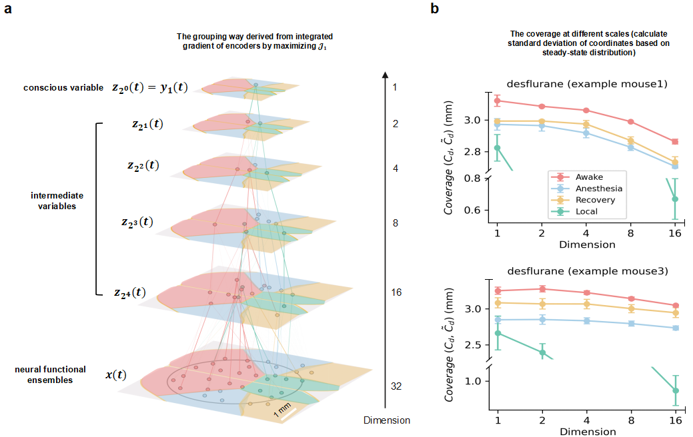

# Causal-Emergence-of-Consciousness-in-Mice

## About

A machine learning framework (NIS+) infers multiscale causal variables, dymamics and information integration mode from cellular-resolution imaging in mouse cortex  across awake, anesthetized, and recovery stages, revealing a top-level "conscious variable" with high emergent complexity that links neural activity to conscious states across scales.

For more details, please refer the following paper:
> Zhipeng Wang, Yingqi Rong, Kaiwei Liu, Mingzhe Yang, Jiang Zhang, Jing He: Causal Emergence of Consciousness through Learned Multiscale Neural Dynamics in Mice. https://arxiv.org/abs/2509.10891

## Schematic diagram

Schematic overview of the study. (a) Experimental setup with a mouse inhaling anesthetic gas and the corresponding brain region/neuron distribution. (b) Timeline of the three anesthesia stages. (c) Neuronal activity (calcium signals). (d) The NIS+ model learns to predict neural dynamics and maximize effective information. (e) Key outputs include causal effects, information integration strategy and learned emergent dynamics.

<div align="center">
    
</div>

## Results

### Emergent dynamics

A one-dimensional macroscopic “conscious variable” is found to summarize all neural activities in the brain which concentrates the strongest causal power, displaying metastable dynamics in wakefulness but collapsing into unstable dynamics under anesthesia (Fig. a). These state-dependent patterns are further supported by saddle-point dynamics in two-dimensional latent spaces, a hallmark of critical brain states linked to conscious processing (Fig. b).


### Mutil-scale causal power

Fig. a and Fig. b show mutil-scale causal power ($\mathcal{J}_d$) and causal emergence ($\Delta \mathcal{J}_d$) across different scales. The study found that across all three stages, the degree of causal emergence ($\Delta \mathcal{J}_d$) peaked at the highest scale (lowest dimension: $d=1$), and $\Delta \mathcal{J}_1$ can distinguish among three stages. Besides, rather than being concentrated at a single optimal level, the causal power underlying consciousness is dispersed through a hierarchy of interactions that link micro-level dynamics to macroscopic patterns.


### Information integration

Attribution analysis reveals how macro-variables integrate micro-scale information. The coverage ($C_d$), measuring the spatial extent of neural ensembles contributing to a macroscopic causal variable, increases at higher scales (lower *d*), indicating broader information integration. Coverage is also significantly greater during wakefulness than under anesthesia or recovery. Attribution analysis uncovers a scale-dependent functional dissociation: micro-scale variables predominantly support information integration, whereas macroscopic causal variables are primarily responsible for transmitting causal information.




## Usages

To enhance computational efficiency, we adopt a multistory framework : (i) parallel training of all forward dynamics across scales during stage one, using the average microscopic loss of all scales for gradient updates; and (ii) maximizing ($\mathcal{J}_d$) independently for each scale

**Stage One**
```
bash run_mice_stage1.sh 
```

**Stage Two**
```
bash run_mice_stage2.sh 
```


## Contact
If you have any question about the paper or the code, 
please contact us.
**Zhipeng Wang**, **19906810976@163.com**

Please cite that paper if you use this code. Thanks!